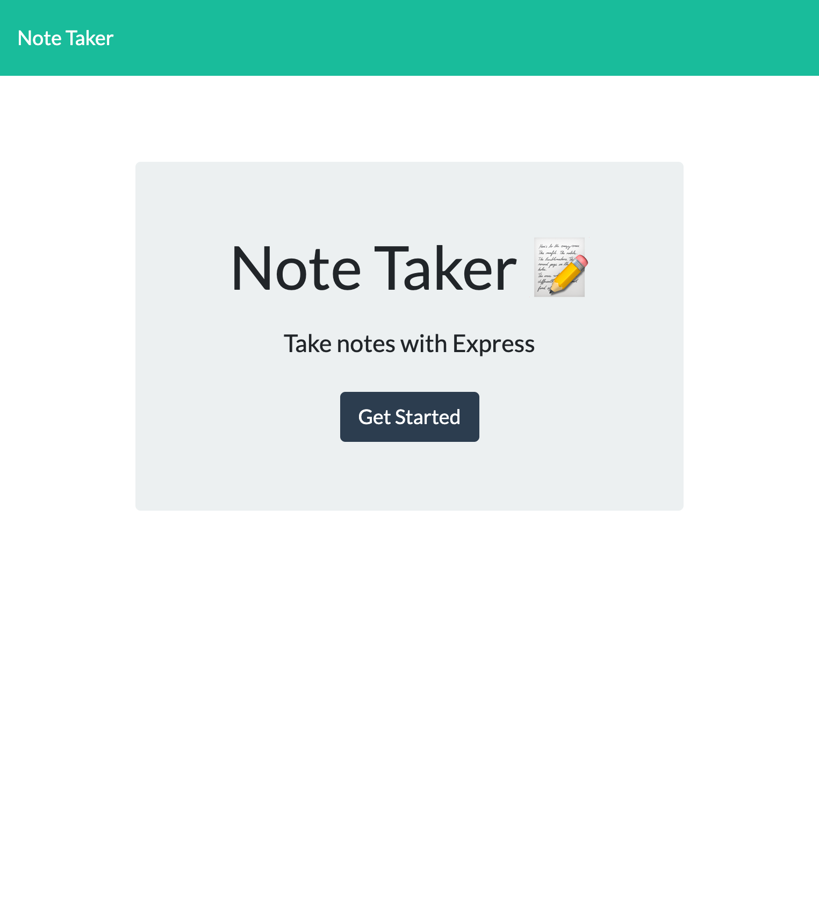

# supreme-notetaker

## Description
Using node and express, I used get and post requests to create a functional note taker application. The note taker landing pages links to a page where users can input and save notes. Once a user inputs a note title and text, the user can then save the note using the save icon button on the top right. Upon doing so, the plus button can be used to create a new note. Users can return to existing notes afterwards as well. 

## Screenshots

## Links
Git Hub Repo Link: https://github.com/hasnafar/supreme-notetaker
Deployed  URL: https://supreme--notetaker.herokuapp.com/